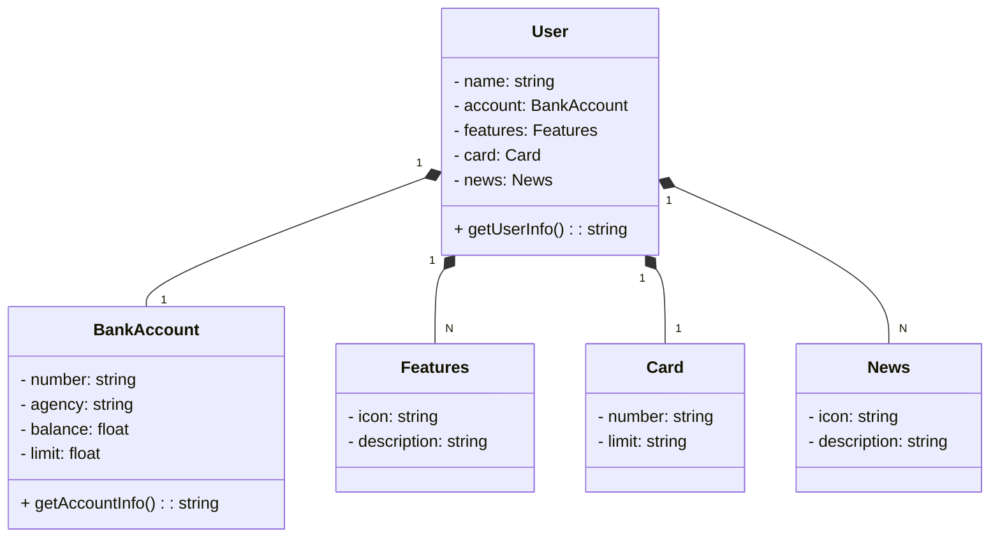

# Desafio Santander Bootcamp
Desafio realizado para a finalização do Bootcamp Santander da DIO

## Diagrama de Classes

```mermaid

classDiagram
  class User {
    - name: string
    - account: BankAccount
    - features: Features
    - card: Card
    - news: News
    + getUserInfo(): string
  }
  
  class BankAccount {
    - number: string
    - agency: string
    - balance: float
    - limit: float
    + getAccountInfo(): string
  }

  class Features {
    - icon: string
    - description: string
  }

  class Card {
    - number: string
    - limit: string
  }

  class News {
    - icon: string
    - description: string
  }

  User "1"*--"1" BankAccount
  User "1"*--"N" Features
  User "1"*--"1" Card
  User "1"*--"N" News
```
